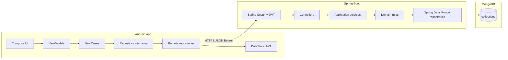

# Águia Branca API

Backend da Sprint 2: monólito modular em **Java 21 + Spring Boot 3.4 + Spring Data MongoDB**.

O enunciado do desafio menciona JPA/Hibernate. Esta API persiste em MongoDB; o equivalente idiomático no ecossistema Spring é **Spring Data MongoDB**, não JPA (ADR-001). Não há `spring-boot-starter-data-jpa` neste módulo.

Pacote base: `br.com.fiap.aguiabranca`. Artefato: `aguiabranca-api`. Porta: `8080`. Prefixo: `/api/v1`.

## Fatia atual

Autenticação JWT (access 1h + refresh 7d), perfil do usuário logado, **listagem de usuários**, **CRUD de diretrizes com histórico append-only**, **ideias com curadoria de status**, **projetos** (criação a partir de ideia aprovada, atualização com ROI calculado, leitura do gestor e da liderança), seed das contas demo e das 2 diretrizes, contrato de erro global, OpenAPI.

Os dashboards calculam os números no servidor (fuso `America/Sao_Paulo`) e o insight Gemini é só do líder. O app Android consome esta API pelos repositórios remotos; o chat de colaboradores permanece mock local. O `API_BASE_URL` do emulador está abaixo.

## Pré-requisitos

- JDK 21
- Maven 3.9+
- MongoDB 7 local **ou** Docker

## Como subir

Mongo (reusa o container se ele já existir):

```powershell
docker start aguia-mongo 2>$null; if ($LASTEXITCODE -ne 0) { docker run -d --name aguia-mongo -p 27017:27017 mongo:7 }
```

API (PowerShell — aspas no `-D` são obrigatórias):

```powershell
cd backend
copy .env.example .env
mvn spring-boot:run "-Dspring-boot.run.profiles=local"
```

O `.env.example` já define `SPRING_PROFILES_ACTIVE=local`. Sem aspas, o PowerShell quebra `-Dspring-boot.run.profiles=local` e o Maven tenta rodar a fase `.run.profiles=local`.

Se a subida falhar com `JWT_SECRET deve ter no mínimo 32 bytes`, o `.env` não foi lido. Confirme que o arquivo `backend/.env` existe e rode o `mvn` **de dentro de** `backend/`.

O `.env` **não vai no zip** da entrega. Sem `GEMINI_API_KEY`, o líder ainda gera insight: HTTP **200** e `source=FALLBACK` (texto local, sem chamar a Google). Para insight real do Gemini, crie uma chave no [Google AI Studio](https://aistudio.google.com/apikey), coloque em `GEMINI_API_KEY` no `.env` e **reinicie** a API. A chave não entra em log nem na resposta.

Swagger: [http://localhost:8080/swagger-ui.html](http://localhost:8080/swagger-ui.html)  
OpenAPI JSON: [http://localhost:8080/v3/api-docs](http://localhost:8080/v3/api-docs)  
Health: [http://localhost:8080/actuator/health](http://localhost:8080/actuator/health)

App Android (fatias seguintes): `API_BASE_URL=http://10.0.2.2:8080/`

## Contas demo (profile `local`)

| Perfil | E-mail | Senha | Role |
|--------|--------|-------|------|
| Operador | `operador@innovatecorp.com` | `oper123` | `OPERATOR` |
| Gestor | `gestor@innovatecorp.com` | `gest123` | `MANAGER` |
| Liderança | `lideranca@innovatecorp.com` | `lider123` | `LEADER` |

O seed é **idempotente** (`existsByEmail` / `existsById`+`existsByTitle` nas diretrizes). Restart não duplica contas nem as 2 diretrizes.

## Como testar o login no Swagger

1. Suba Mongo + API com o profile `local`.
2. Abra `http://localhost:8080/swagger-ui.html`.
3. Em **Auth**, execute `POST /api/v1/auth/login` com:

```json
{ "email": "operador@innovatecorp.com", "password": "oper123" }
```

4. Copie o `accessToken` da resposta.
5. Clique em **Authorize**, informe `Bearer <accessToken>` (ou só o token, conforme o campo).
6. Execute `GET /api/v1/auth/me` — deve retornar o operador.

Refresh: `POST /api/v1/auth/refresh` com o `refreshToken`. Logout: `POST /api/v1/auth/logout` (autenticado).

## Como testar users e guidelines no Swagger

1. Faça login como **gestor** (`gestor@innovatecorp.com` / `gest123`) e Authorize com o `accessToken`.
2. `GET /api/v1/users` — 200, página sem `passwordHash`. Filtros: `role=OPERATOR`, `q=Mariana`.
3. Troque o token para o **operador** e repita `GET /users` — 403 `FORBIDDEN`.
4. Login como **liderança** (`lideranca@innovatecorp.com` / `lider123`).
5. `GET /api/v1/guidelines` — 200 com as 2 diretrizes seed (Transformação Digital, Sustentabilidade Corporativa). Operador e gestor também leem.
6. `POST /api/v1/guidelines` com title ≥3 e content ≥10 — 201, `version=1`. Gestor/operador — 403.
7. `PUT /api/v1/guidelines/{id}` — 200 e `version` incrementa. `GET /guidelines/{id}/history` — só líder; gestor/operador — 403.
8. `DELETE /api/v1/guidelines/{id}` — 204. A lista deixa de mostrar o item; o histórico permanece.

## Como testar ideias no Swagger

1. Login como **operador** (`operador@innovatecorp.com` / `oper123`) e Authorize com o `accessToken`.
2. `POST /api/v1/ideas` com title ≥3, description ≥10 e `category` (`PROCESS`, `PRODUCT`, `TECHNOLOGY`, `SUSTAINABILITY` ou `OTHER`). Omita `guidelineId` para vincular a diretriz mais recentemente atualizada. Resposta 201, `status=PENDING`, `authorId` do operador.
3. `GET /api/v1/ideas` — só as ideias desse operador.
4. Troque o token para o **gestor** (`gestor@innovatecorp.com` / `gest123`).
5. `GET /api/v1/ideas` — todas as ideias. Filtros: `status=PENDING`, `category`, `q`, `from`, `to`, `mine=true` (só as que o gestor criou).
6. `PATCH /api/v1/ideas/{id}/status` com `{ "status": "APPROVED" }` — 200 e `decisionHistory` ganha o item APPROVED.
7. Para reprovar: `{ "status": "REJECTED", "justification": "Fora da diretriz deste semestre." }` (mínimo 10 caracteres). Sem justificativa — 400.
8. Login como **liderança** e repita o POST ou o PATCH — 403. Operador no PATCH — 403. Operador lendo ideia de outro — 404.
9. Ideia já convertida em projeto: `PATCH` para `REJECTED` — 409 `IDEA_ALREADY_HAS_PROJECT`. A ideia permanece aprovada. `PRIORITIZED` continua permitido.

## Como testar projetos no Swagger

1. Login como **operador** e `POST /api/v1/ideas` (title ≥3, description ≥10, category). Anote o `id`.
2. Troque o token para o **gestor** (`gestor@innovatecorp.com` / `gest123`).
3. `PATCH /api/v1/ideas/{id}/status` com `{ "status": "APPROVED" }`.
4. `POST /api/v1/projects` com `{ "ideaId": "<id da ideia>" }` — 201, `status=BACKLOG`, título e `guidelineId` copiados, números em 0, `roiPercent=0`. Repetir o POST — 409 `IDEA_ALREADY_HAS_PROJECT`. Ideia `PENDING` — 422. Líder ou operador neste POST — 403.
5. `PUT /api/v1/projects/{id}` com `investmentAmount` 200 e `obtainedProfit` 100 — 200 e `roiPercent=-50`. Investimento 0 — `roiPercent=0`. `productivityGainPercent` 101 — 400. O ROI não fica gravado no Mongo.
6. Login como **liderança** e `GET /api/v1/projects` — 200. O mesmo GET com o operador — 403. `GET /api/v1/projects/{id}` é o relatório do projeto.
7. `DELETE /api/v1/projects/{id}` como gestor — 204. A ideia continua existindo. Líder no DELETE — 403.

## Como testar dashboard e Gemini no Swagger

1. Suba Mongo + API com o profile `local`. A key pode ficar vazia em `GEMINI_API_KEY`: o POST de insight responde **200** com `source=FALLBACK` e não chama o Google.
2. Login como **liderança** (`lideranca@innovatecorp.com` / `lider123`) e Authorize.
3. Crie um projeto com investimento e lucro (fluxo de projetos, como gestor) e volte ao token da liderança.
4. `GET /api/v1/dashboard/leader` — 200 com `overallRoiPercent` calculado no servidor (mesma fórmula de `roiPercent` do projeto: `(lucro total - investimento total) / investimento total × 100`; investimento 0 no total produz 0). Lista vazia devolve zeros e `hasData=false`, nunca 404.
5. `GET /api/v1/dashboard/strategies` — uma linha por diretriz. Projeto sem diretriz aparece em **"Sem estratégia"**.
6. `GET /api/v1/dashboard/period?from=2026-01-01T00:00:00Z&to=2026-12-31T23:59:59Z` — mesmo consolidado, filtrando `createdAt`. `from` posterior a `to`, ou um dos dois ausente — 400.
7. `GET /api/v1/dashboard/manager` — a liderança também lê. `GET /api/v1/dashboard/operator` com esse token — 403.
8. `POST /api/v1/ai/insights` sem body — 200. Com key válida, `source=GEMINI`; sem key, timeout ou texto vazio, `source=FALLBACK`. O texto traz o disclaimer: não é fato contábil. `basedOn` só tem totais (sem e-mail).
9. `GET /api/v1/ai/insights/latest` — o último insight desse líder. Antes da primeira geração — 404.
10. Troque para o **gestor**: `GET /dashboard/manager` e `GET /dashboard/rankings` — 200, nomes e e-mails vindos de `users`. `GET /dashboard/leader` e `POST /ai/insights` — 403.
11. Troque para o **operador**: `GET /dashboard/operator` — só as ideias dele. Os outros dashboards — 403.

Barras do gestor e tendências usam o mês civil em **America/Sao_Paulo**. A tendência de aprovadas conta o `occurredAt` do primeiro evento `APPROVED` ou `PRIORITIZED`, não a data de criação da ideia. A quota gratuita do Gemini pode acabar; o fallback cobre a demo. A key não entra em log nem na resposta.

## Endpoints desta fatia

| Método | Rota | Auth |
|--------|------|------|
| POST | `/api/v1/auth/register` | público |
| POST | `/api/v1/auth/login` | público |
| POST | `/api/v1/auth/refresh` | público |
| POST | `/api/v1/auth/logout` | Bearer |
| POST | `/api/v1/auth/reset-password` | público (acadêmico) |
| GET | `/api/v1/auth/me` | Bearer |
| PATCH | `/api/v1/users/me` | Bearer |
| GET | `/api/v1/users` | Bearer (MANAGER, LEADER; OPERATOR 403) |
| GET | `/api/v1/guidelines` | Bearer |
| GET | `/api/v1/guidelines/{id}` | Bearer |
| POST | `/api/v1/guidelines` | Bearer (LEADER) |
| PUT | `/api/v1/guidelines/{id}` | Bearer (LEADER) |
| DELETE | `/api/v1/guidelines/{id}` | Bearer (LEADER) |
| GET | `/api/v1/guidelines/{id}/history` | Bearer (LEADER) |
| GET | `/api/v1/ideas` | Bearer (escopo do papel) |
| POST | `/api/v1/ideas` | Bearer (OPERATOR, MANAGER) |
| GET | `/api/v1/ideas/{id}` | Bearer (OPERATOR só a própria; senão 404) |
| PATCH | `/api/v1/ideas/{id}/status` | Bearer (MANAGER) |
| GET | `/api/v1/projects` | Bearer (MANAGER, LEADER; OPERATOR 403) |
| POST | `/api/v1/projects` | Bearer (MANAGER) |
| GET | `/api/v1/projects/{id}` | Bearer (MANAGER, LEADER; relatório do projeto) |
| PUT | `/api/v1/projects/{id}` | Bearer (MANAGER) |
| DELETE | `/api/v1/projects/{id}` | Bearer (MANAGER; a ideia permanece) |
| GET | `/api/v1/projects/by-idea/{ideaId}` | Bearer (MANAGER, LEADER; 404 se não houver projeto) |
| GET | `/api/v1/dashboard/operator` | Bearer (OPERATOR) |
| GET | `/api/v1/dashboard/manager` | Bearer (MANAGER, LEADER) |
| GET | `/api/v1/dashboard/leader` | Bearer (LEADER) |
| GET | `/api/v1/dashboard/strategies` | Bearer (LEADER) |
| GET | `/api/v1/dashboard/period` | Bearer (LEADER; `from` e `to` obrigatórios) |
| GET | `/api/v1/dashboard/rankings` | Bearer (MANAGER, LEADER; `period=MONTH` ou `ALL`) |
| POST | `/api/v1/ai/insights` | Bearer (LEADER; falha da IA continua 200 `FALLBACK`) |
| GET | `/api/v1/ai/insights/latest` | Bearer (LEADER; 404 se nunca gerou) |

## Segurança

- Spring Security **stateless**, CSRF desligado.
- Access JWT HS256, 60 minutos, claims `sub`, `email`, `role`, `jti`, issuer `aguiabranca`.
- Refresh opaco (UUID) hasheado em SHA-256 na coleção `refresh_tokens`, 7 dias, com rotação.
- Senha: BCrypt strength 10. Nunca retornada nem logada.
- Secret JWT: variável `JWT_SECRET`, mínimo 32 bytes. Não commitar `.env`.

## Arquitetura



Organização por feature (`auth/`, `user/`, `guideline/`, `idea/`, `project/`, `dashboard/`, `ai/`, `common/`, `security/`, `seed/`). O ROI de um projeto e o ROI consolidado passam por `ProjectRoi`.

## Testes

```bash
cd backend
mvn test
```

Cobertura desta fatia: A-AUTH-01..05, A-USER-01..02, A-GL-01..03, A-SEC-01..04, A-IDEA-01..05, A-PROJ-01..04, A-CALC-01 (ROI do item, a mesma função do consolidado), A-DASH-01..05, A-RANK-01, A-AI-01, A-OPS-01, A-OPS-02 (Testcontainers `mongo:7`).

## Configuração

Variáveis documentadas em `.env.example`. `application.yml` não contém secrets reais.

`GEMINI_API_KEY` fica só no ambiente (vazia no `.env.example`; o `.env` real não entra no zip). Sem key, ou se o Gemini estourar a quota, `POST /api/v1/ai/insights` responde 200 `source=FALLBACK` — o app do líder mostra o texto, com o aviso de que não é IA. Com key válida e API reiniciada, `source=GEMINI` (modelo `gemini-3.6-flash`, `GEMINI_MODEL`; timeout 12s). AdviceSlip segue em `GET /api/v1/insights/daily`.
