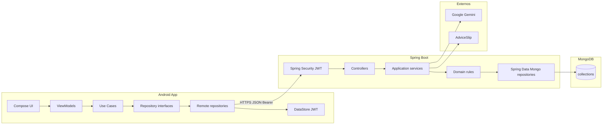
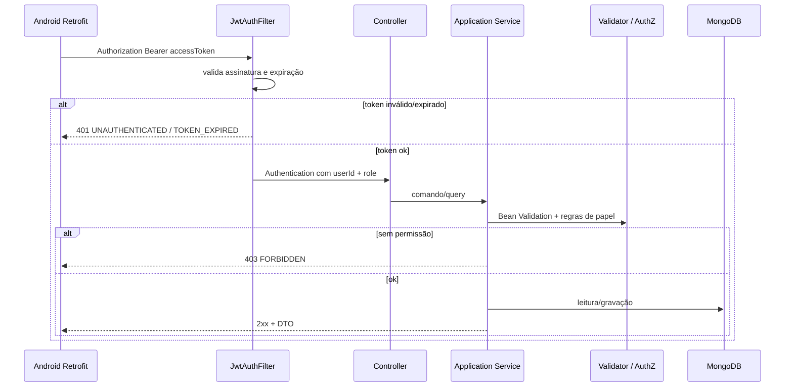
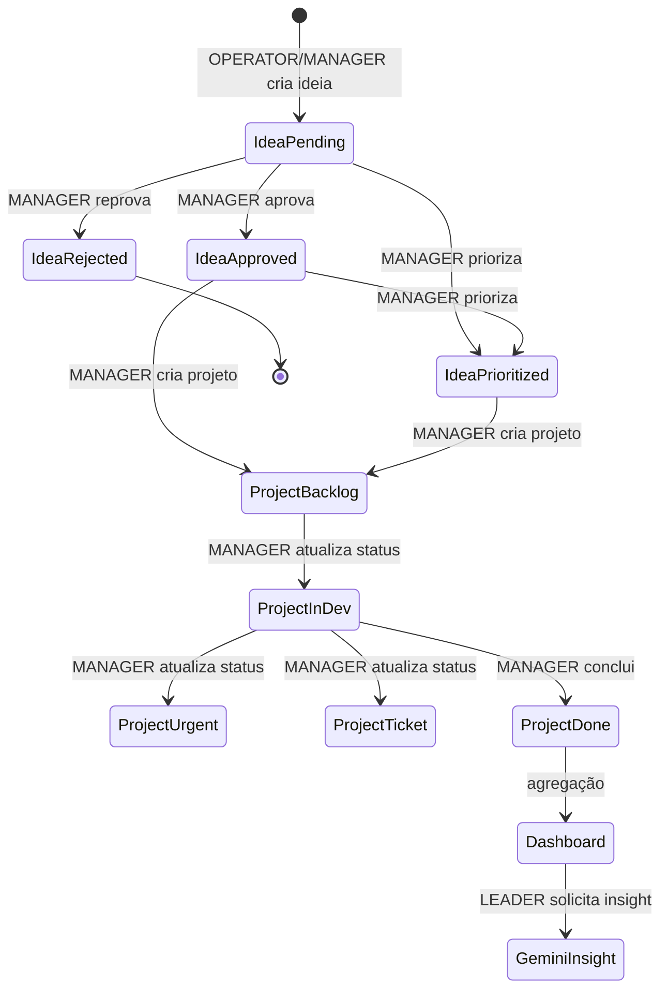
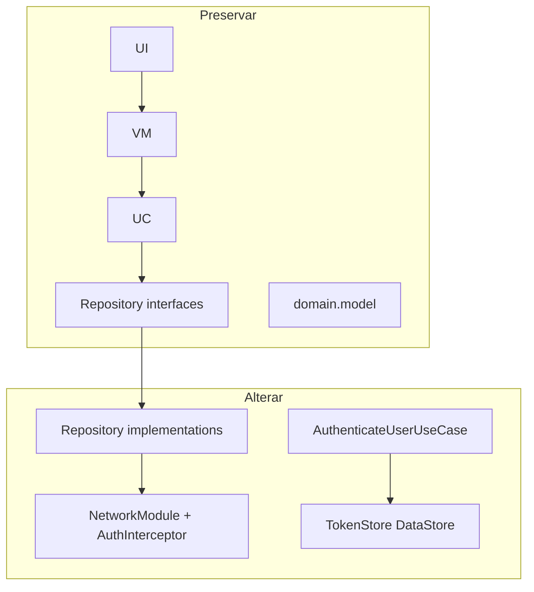

# 02 — Arquitetura do backend

## 1. Estilo

**Monólito modular Spring Boot**, organizado por **feature/domínio**, com um kernel compartilhado.

Não usar microserviços na Sprint 2. O volume de domínio (ideias, projetos, diretrizes, dashboard) é um único bounded context de gestão de inovação.

### Por que não copiar um template genérico

O app Android já divide o domínio em Idea / Project / Guideline / Session / Suggestion / Dashboard. O backend espelha esses bounded contexts para que cada Repository Android tenha um cliente HTTP óbvio, sem um único `InnovationController` gigante.

## 2. Diagrama de contexto



## 3. Fluxo de uma requisição autenticada



## 4. Ciclo de negócio (visão arquitetural)



Estados de projeto aceitam qualquer valor do enum Sprint 1 (não há DAG rígido além de regras em `05-business-rules.md`).

## 5. Estrutura de pacotes (obrigatória)

Raiz: `backend/`

```
backend/
  pom.xml                          # Maven (decidir Maven; ver ADR-002)
  README.md
  .env.example
  src/main/java/br/com/fiap/aguiabranca/
    AguiaBrancaApplication.java
    common/
      api/          # ApiError, ApiPage, PageQuery
      exception/    # BusinessException, NotFoundException, handlers
      web/          # CorrelationIdFilter
      time/         # Clock
    config/
      MongoConfig, SecurityConfig, CorsConfig, OpenApiConfig, RestClientConfig
    security/
      jwt/          # JwtService, JwtAuthFilter, JwtProperties
      hash/         # PasswordEncoder
      current/      # CurrentUser (id, email, role)
    auth/           # login, refresh, register, logout
    user/
    guideline/
    idea/
    project/
    suggestion/
    dashboard/
    insight/        # AdviceSlip proxy + daily insight
    ai/             # Gemini
    notification/   # projeções derivadas
    seed/           # DataInitializer
  src/main/resources/
    application.yml
    application-local.yml
    application-test.yml
  src/test/java/...
```

Dentro de cada feature:

```
{feature}/
  api/{Feature}Controller.java
  api/dto/          # request/response records
  application/      # services / use cases
  domain/           # enums, regras puras, value objects
  infra/            # documentos Mongo, repositories Spring Data, adapters
```

Dependências permitidas:

- `api` → `application` → `domain`
- `infra` implementa portas usadas por `application`
- `api` **não** acessa Mongo template
- `domain` **não** depende de Spring Web / Security / Mongo annotations de API

Nomes de documento Mongo: `*Document` (ex.: `IdeaDocument`).  
Não usar `@Entity` JPA.

## 6. Relação com o Android



Detalhe: `11-android-integration.md`.

## 7. Fronteiras de integração

| Destino | Quem chama | O app Android chama? |
|---------|------------|----------------------|
| MongoDB | Backend | Não |
| Gemini | Backend `ai` | Não |
| AdviceSlip | Backend `insight` | Não (Sprint 2) |
| FakerAPI | Ninguém | Não |

## 8. Módulo Maven único

Um único artefato `aguiabranca-api`. Multi-module Maven é desnecessário nesta sprint.

Java 21, Spring Boot 3.4.x.

Porta padrão: `8080`. Context path: vazio. API prefix: `/api/v1`.

## 9. Ambientes

| Profile | Uso |
|---------|-----|
| `local` | Mongo local, seed ligado, CORS permissivo para emulador |
| `test` | Testcontainers Mongo |
| `prod` | seed desligado, CORS restrito, logs INFO |

Ativação: `spring.profiles.active`.

## 10. Crescimento futuro

Novas features entram como pacotes irmãos (`report/`, `audit/` extra).  
Não criar dependência `idea` → `ai`. Dashboard/AI leem projeções via services de consulta, não via controllers.

Notificações da Sprint 2 são **projeções síncronas** (GET monta a lista). Não introduzir broker.
